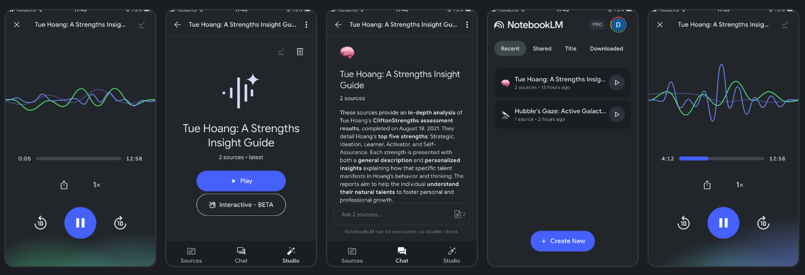

# Exploring NotebookLM Insights

- Dare to Dream
- Inspire Bold Leadership
- Embrace Diversity in Thought and Innovation
- Explore together & unlock the world's knowledge

----------------------

**Objective:** Discovering AI-driven insights and learning with NotebookLM 

An AI-powered learning companion with the objective to transform research, study, and comprehension by enabling students and educators to interact directly with their documents through summaries, Q&A, mind maps, and AI-generated audio overviews.

## What is NotebookLM?

My first **NotebookLM** is powered by an advanced **Google’s Gemini multimodal large language model** and generates responses strictly based on the content (PDF, website, text, video) you upload. Additionally, I am using a **Pixel 9 Pro** smartphone, equipped with Google’s Tensor G4 chip and integrated with Google One AI, to enhance performance and AI capabilities.

---

## Discovering Key Features 

| Feature | Description |
|--------|-------------|
|  **Document-Grounded Chat** | Ask questions about your docs, notes, textbooks, research papers, or lecture slides. |
|  **Smart Summaries** | Get concise chapter summaries, key takeaways, or concept explanations. |
|  **Audio Overviews** | Turn any document into a _podcast-style summary with interactive-handup-for-question ✋_ with voice-- _I really really like this_!!! |
|  **Mind Maps** | Visualize complex topics to deepen understanding and improve recall. |
|  **Citation-Aware** | Every answer is linked to its source—great for academic integrity. |
|  **Collaboration** | Share Notebooks with peers or students for group study or teaching. |
|  **Multilingual Support** | Output in 35+ languages for accessibility and global classrooms - AWESOME! |

---

##  Example Use Cases

### Analyzing My Profile:

- CliftonStrengths: Insights About Me: _Tuệ Hoàng, Eng._

_Podcast-Style Summary: https://notebooklm.google.com/notebook/d193eb02-33a4-4f8d-81a0-9a13336ebefa/audio/__

--------------

### For potential Students & Profs:
- Study guides from course materials
- Prep for exams with Q&A
- Convert notes to audio for passive review
- Summarize readings for students
- Share curated notebooks with embedded prompts
- Use audio overviews for flipped classrooms

-------------

### Special Note From Google:
- Enable safe AI use for under-18 students via Google Workspace for Education
- Supports under-18 access via Google for Education accounts
- Foster inclusive, differentiated learning

_Source: https://edu.google.co.id/intl/ALL_us/our-values/privacy-security/frequently-asked-questions/_

---------------

## Additional Resources

- [NotebookLM Teacher Guide (PDF)](https://edu.google.com)
- [Google Workspace for Education Setup](https://workspace.google.com/education/)
- [Classroom Integration Tips](https://blog.google/technology/education/notebooklm-for-classrooms/)

---

**Empower every student to learn with AI—on their terms, at their pace.**
